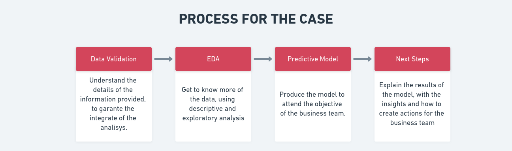

# Data Analytics Case
###### [By Israel Mendes](https://github.com/israelmendez232)
Test for the iFood team of Data Analytics Team
The test is separated on: 
1. [Data Validation](https://databricks-prod-cloudfront.cloud.databricks.com/public/4027ec902e239c93eaaa8714f173bcfc/2372086426737077/449765189887875/7923806185164002/latest.html)
2. [Exploratory Data Analysis](https://databricks-prod-cloudfront.cloud.databricks.com/public/4027ec902e239c93eaaa8714f173bcfc/2372086426737077/449765189887902/7923806185164002/latest.html)
3. [Predictive Model](https://databricks-prod-cloudfront.cloud.databricks.com/public/4027ec902e239c93eaaa8714f173bcfc/2372086426737077/449765189887900/7923806185164002/latest.html)
4. Next Steps (for the presentation)

--- 

## Process
Here is the main step broken down:

---

## Tools
I used the main elements present [here](https://medium.com/ifood-tech/como-%C3%A9-ser-um-data-analyst-no-ifood-9633f24b29cc) in this article about data analyst on iFood and obvously about the job description. Main elements were:
- **Databricks**: to generate the notebooks;
- **Tableau:** to create the final visualizations for the business teams.
